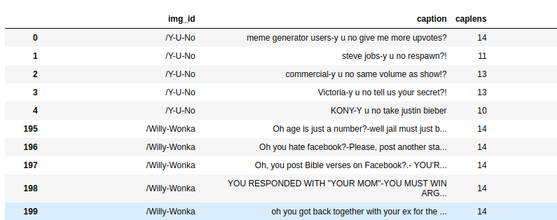

# Meme Generator
An Image captioning system, which given any image can produce a humorous and relevant caption. This repository implements the ideas given in the paper "Show, Attend and Tell" by Kelvin Xu.

## Architecture
This system uses encoder-decoder architecture where the encoder uses ResNet101 and grab the image embeddings from the last convolution layer. These embeddings are sent to the decoder for generating caption. Decoder Network uses attention mechanism(Soft Attention) to focus on particular parts of the image and send these to a LSTM layers.

## Dataset
Data was scraped from the website "memegenerator.net". Each image has 190-200 corresponding captions.

## Requirements
1. Pytorch
2. Numpy
3. Pandas
4. Matplotlib
5. Pickle
6. bs4

## Steps to execute
1. To collect dataset first execute data_scraper.py. This will download the whole dataset and generate a captions.csv file containing  img_id and corresponding captions.
2. Execute the preprocess_data.ipynb this will create the vocabulary, word embeddings, int_to_vocab and vocab_to_int python dictionary to the dicts folder. Also, it will split the data into training and testing data and save it in the npy format to the data folder.
3. There is dataset.py and models.py files which contains Dataset loader and this system architecture respectively.
4. Execute train.ipynb for training the model.

## Output
The output of the model is a encoded caption to the image use the int_to_vocab dict for converting the encodings to words.

## Future work
- [ ] Add bleu4 score for validation.
- [ ] Add doubly stochastic attention regularization.
- [ ] Implement gradient clipping
